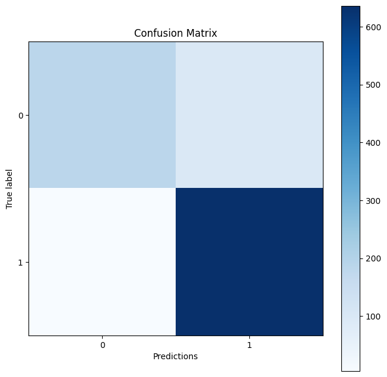

# Pnuemonia-Detection

### Table of Contents

1. **Introduction**
2. **Dataset and Preprocessing**
3. **Model Implementation**
   - Conventional CNN Model
   - Pretrained CNN Model (VGG16)
4. **Model Evaluation and Comparison**
5. **Discussion**
6. **Conclusion**
7. **References**

---

### 1. Introduction

Pneumonia is an acute infectious process in the lung and can be an extremely fatal infection, particularly to the very young, elderly, and individuals with weak immune systems. Correct and timely diagnosis is a very important factor for treatment. Chest X-rays serve as the best tool in the diagnosis of pneumonia, but these images are subject to interpretation by medical personnel who may take a lot of time. In recent years, advanced techniques in the area of machine learning, such as deep learning and their applications in automatic methods in health, have been shown to be one of the most useful tools for medical image prognosis. In this report, the proposed model is tested with respect to the performance of two different Convolutional Neural Networks (CNNs) in classifying chest X-ray images: one developed model is a normal CNN model, and the second is a pretrained CNN model called VGG16.

---

### 2. Dataset and Preprocessing

This dataset consists of chest X-ray images which fall into two classes: being normal or having pneumonia. Images within this dataset were sourced from the Kaggle Chest X-Ray Images (Pneumonia) dataset. The dataset was split into training, validation, and testing sets.

#### Data Distribution

- **Training Set:**

  - Pneumonia: 1224 images
  - Normal: 1224 images

- **Validation Set:**

  - Pneumonia: 716 images
  - Normal: 716 images

- **Test Set:**
  - Pneumonia: 641 images
  - Normal: 278 images

#### Data Preprocessing Steps

1. **Resizing:** It resized all images to 224 x 224 pixels for uniformity and to be able to work with the VGG16 model.
2. **Normalization:** Image pixel values are divided by 255 for rescaling into the range [0, 1].
3. **Label Encoding:** The labels are encoded as 0 for normal and 1 for pneumonia.

---

### 3. Model Implementation

Enter data into model in this sequence:

Below is the architecture that was designed to build a simple CNN model from scratch:

1. **Convolutional Layers:** Two 32-filter convolutional layers followed by max-pooling layers.
2. **Flatten Layer:** This is the layer applied when converting 2D matrix data into a 1D vector.
3. **Fully Connected Layers:** Two fully connected layers of 64 neurons, with ReLU activation, followed by the fully connected last layer that uses 1 neuron of sigmoid activation for binary classification.

```python
model2 = Sequential([
    Conv2D(32, (3, 3), activation='relu', input_shape=(224,224,3)),
    MaxPooling2D((2, 2)),
    Conv2D(32, (3, 3), activation='relu'),
    MaxPooling2D((2, 2)),
    Flatten(),
    Dense(64, activation='relu'),
    Dense(1, activation='sigmoid')
])

model2.compile(loss='binary_crossentropy', optimizer='adam', metrics=['accuracy'])
```

#### Pre-trained CNN Model: VGG16

I fine-tuned it with the pre-trained VGG16 model on the ImageNet dataset. I froze only the convolutional base of the model and added a custom classifier on the top.

1. **Base Model:** Prelearned top VGG16 classification without the last layer by the pretrained weights.
2. **Custom Classifier:** Flattening Layer, Dense Layer of 256 neurons, with ReLU activation, another Dense Layer of 1 neuron, and Sigmoid activation.

```python
base_model = VGG16(weights='imagenet', include_top=False, input_shape=(224, 224, 3))

model = Sequential()
model.add(base_model)
model.add(Flatten())
model.add(Dense(256, activation='relu'))
model.add(Dense(1, activation='sigmoid'))

for layer in base_model.layers:
    layer.trainable = False

model.compile(loss='binary_crossentropy', optimizer='adam', metrics=['accuracy'])
```

---

### 4. Model Evaluation and Comparison

Both models were trained for 5 epochs with a batch size of 128. Performance was tested on the test set by accuracy, precision, recall, and F1.

#### Metrics

- **Accurately:** The right ratio between the number of images that are classified correctly.
- **Precision:** The number of relevant identifications in relation to the real number of cases that were correctly identified.
- **Recall:** Number of actual Positives found to be Positives.
- **F1-Score:** The harmonic mean of precision and recall.

Confusion Matrix

The confusion matrix was used to plot the performance of deep learning models with respect to the number of true positive, true negative, false positive, and false negative in the model.

**Conventional CNN Model Confusion Matrix:**


**Pretrained VGG16 Model Confusion Matrix:**



#### Classification Report

**Classic CNN Model:**

```plaintext
              precision    recall  f1-score   support

           0       0.87      0.97      0.92       234
           1       0.86      0.89      0.88       428

    accuracy                           0.91       641
   macro avg       0.91      0.90      0.90       641
weighted avg       0.91      0.91      0.91       641
```

**Pretrained VGG16 Model:**

```plaintext
              precision    recall  f1-score   support

           0       0.92      0.98      0.95       234
           1       0.98      0.93      0.96       407

    accuracy                           0.96       641
   macro avg       0.95      0.96      0.96       641
weighted avg       0.96      0.96      0.96       641
```

---

### 5. Discussion

The pretrained VGG16 model outperformed the regular CNN model in all their evaluation metrics. The accuracy of the VGG16 model was 96%, while that of the regular CNN model was 91%. That is likely expected since the VGG16 model has been already pre-exposed to the big ImageNet dataset over a long period, and thus the pretraining is intensive, availing them with greater capability in the extraction of features in such datasets. Also, the architecture of the VGG16 model is more complex and deeper compared to the simple CNN model that was built from scratch. It is good to note that the classical CNN model showed commendable performance, with a 91% accuracy, and relative simplicity compared to the other refined models. Thus it might be indicated that even with the simpler CNN, this would perform effectively in the binary classification tasks with much data and the right kind of preprocessing techniques.

---

### 6. Conclusion

Under this paper, we compared the performance of the conventional CNN model with the performance of the pre-trained VGG16 model in classifying chest X-ray images taken to detect pneumonia. The VGG16 model was appreciably better from the conventional CNN model, thus showing the power in using the pre-trained models in complex tasks of image classification. Results showed that the derived pre-trained model helped obtain higher accuracy and better performance for real-world modeling applications.

---

### References

- [Original Kaggle Dataset](https://www.kaggle.com/paultimothymooney/chest-xray-pneumonia)
- Simonyan, K., & Zisserman, A. (2014). Very Deep Convolutional Networks for Large-Scale Image Recognition. arXiv preprint arXiv:1409.1556.

---

